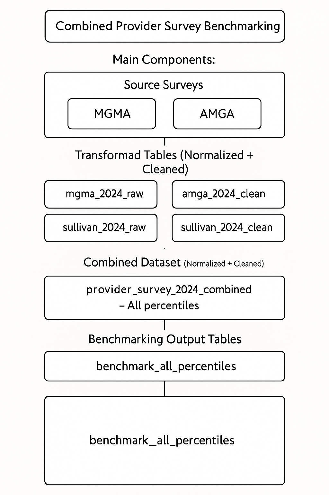
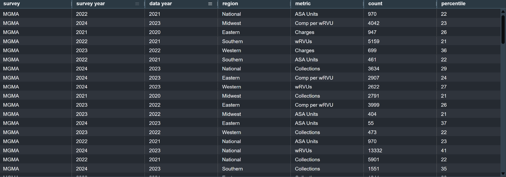
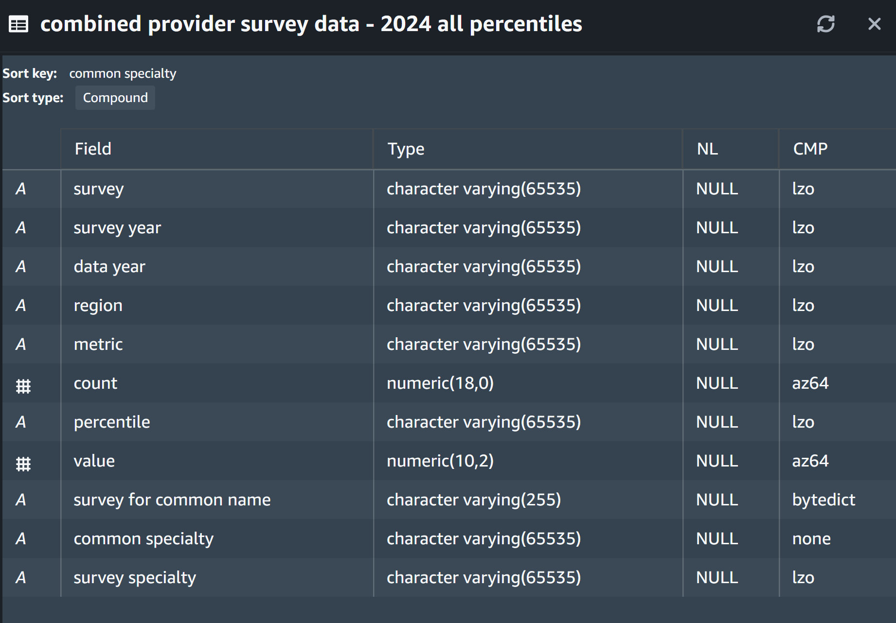
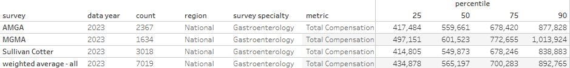

# 🏥 Unified Provider Compensation Benchmarking

This project merges national provider compensation survey data from **MGMA, AMGA**, and **Sullivan Cotter** into a clean, unified benchmark table with percentile interpolation, specialty mapping, and weighted average computations for 2024.

---

## 📦 What This Project Does

✅ Combines multi-year survey tables (2019–2024)  
✅ Interpolates percentiles from 10th to 90th  
✅ Harmonizes specialty names using a common map  
✅ Calculates **weighted averages** across surveys  
✅ Outputs Tableau-ready benchmark tables

---

## 🛠️ Contents

- `sql/Survey.sql`: Combines and cleans survey data
- `sql/HSG National Blended survey.sql`: Creates blended benchmarking output
- `outputs/provider_survey_schema.png`: Schema flow diagram
- `outputs/combined_2024_data_sample.png`: Example raw table from Redshift
- `outputs/combined_2024_tableau_view.png`: Output table in Tableau
- `outputs/hsg_national_blended_view.png`: Weighted average view from Tableau

---

## 📊 Sample Outputs

### 📘 Schema Overview


### 📋 Combined Survey Data Table (Raw)


### 📈 Clean Tableau-Formatted View


### 🧮 Weighted Average Benchmark Output


---

## 🚀 How to Use

1. Run the scripts in order:
   - `Survey.sql`
   - `HSG National Blended survey.sql`

2. Query from:
   ```
   survey_benchmark_data.final outputs."combined provider survey data - 2024 all percentiles"
   ```

3. Load results into Tableau
---

## 📄 License

MIT License – See `LICENSE`
